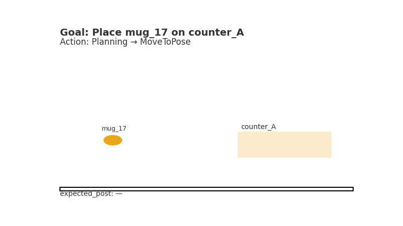
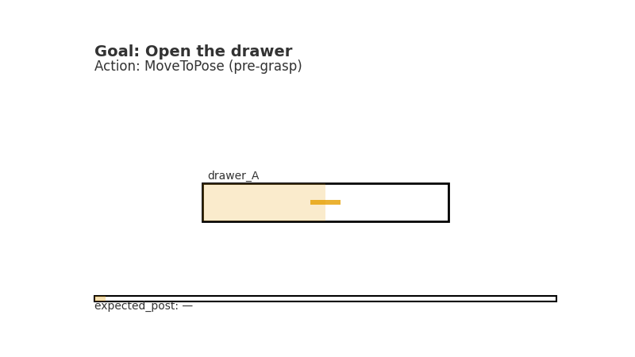

# Mindgrid Robot LLM alternative to NVIDIA Isaac-style stacks.   Starter Backend

<p align="center">
  
|  |  |
|--------------------------------------------------------|---|
| **Kitchen:** Pick → Place                              | **Drawer:** PullWithCompliance → open |

</p>

**Open, local, and robot-native.** An OpenAI-compatible server that returns **structured robot plans** (SkillGraph) via a single tool/function: `robot.plan`.

Ships with:
- **MOCK** backend (rule-based) to run tests without any model
- **OPENAI_COMPAT** backend to proxy OpenAI-style servers (vLLM, **Ollama**, hosted APIs)
- **LLAMA_CPP** backend for local `llama.cpp` HTTP servers
- Hardened pipeline: **normalize → canonicalize → repair → prune → validate**
- **Plan JSON schema validation**
- **Sample scenes + quick test**

---

## 🧠 Why this matters

This is the LLM side of **TaskSafe Graph Planner (TSGP)**. It emits **JSON-only** plans with `commitPoint` and `riskCost` and then shapes them with robotics guardrails so your executor doesn’t eat garbage:

- **Normalization** (types, lists, booleans, numbers)
- **Canonicalization** → skills limited to: `Pick | Place | MoveToPose | PullWithCompliance | Release`
- **Goal Repair** (e.g., ensure `Place` when the goal says “put X on Y”)
- **Prune & Order** (drop hallucinated IDs/poses, enforce deterministic order)
- **Auto Postconditions** (`on(obj, surface)`, `open(drawer)`)
- **Strict schema validation** + **graceful fallback** (MOCK) for stability

> Result: **stable, typed, safety-aware plans** you can feed directly into ROS skills, simulators, or a TSGP executor with S2R-Gate micro-rollouts.

---

## What’s inside & how it hooks into the stack

- **`/v1/chat/completions`** - OpenAI-compatible. Returns a tool call to `robot.plan` with the plan JSON.
- **Ollama JSON-mode** path: robust parsing of messy outputs (code fences, trailing junk) and automatic cleanup.
- **TSGP Hooks** ready:
  - `commitPoint` chunks for **Shadow2Real Gate** rollouts
  - `riskCost` per step for **risk budget** enforcement
  - `expected_post` for **postcondition checks** against perception
  - Chrome Trace-ready structure for **latency & near-miss** metrics
- **ROS-friendly**: canonical skills, deterministic action order, and object IDs that line up with perception/scene graphs.

### Mindgrid components this backend powers
- **mindgrid-vision-vlm** - scene graphs + affordances → feeds `object_id`, `drawer_id`, surfaces.
- **mindgrid-dialogue-ros** - LLM planner + skills orchestrator (this backend slots here).
- **mindgrid-sim-lab** - Webots/Isaac shadow rollouts at each `commitPoint`.
- **mindgrid-voice** - faster-whisper (ASR) → plan → Piper/TTS confirmations at commit points.
- **mindgrid-skill-library** - atomic ROS skills for `Pick/Place/MoveToPose/PullWithCompliance/Release`.

Use this backend as the **planning brain** that keeps the rest honest.

---

## 📦 Quick start - MOCK (no models required)

```bash
# 1) Create and activate a venv (optional)
python -m venv .venv && source .venv/bin/activate

# 2) Install deps
pip install -r requirements.txt

# 3) Run the server (MOCK is default)
uvicorn server.main:app --reload --port 8009

# 4) In another shell, run the test
python scripts/quick_test.py
```
You’ll see a valid plan for kitchen (`Pick → Place`) and a drawer open plan from rules.

---

## 🧱 Quick start - OPENAI_COMPAT with **Ollama** (fully local, free)

### 1) Install & start Ollama
```bash
brew install ollama
ollama serve &
```

### 2) Pull an instruction model
```bash
ollama pull qwen2.5:3b-instruct
# other options: mistral:7b, deepseek-r1:7b (slower/heavier)
```

### 3) Run the server pointed at Ollama
```bash
# inside repo root, with your venv active
export BACKEND=OPENAI_COMPAT
export OPENAI_BASE_URL=http://127.0.0.1:11434/v1
export OPENAI_API_KEY=ollama
export OPENAI_MODEL=qwen2.5:3b-instruct
export OLLAMA_MODE=1   # JSON-only path (no tools), hardened parsing

uvicorn server.main:app --port 8009 --reload
```

### 4) Smoke test
```bash
python scripts/quick_test.py
```
Expected:
- **Kitchen:** `Pick(mug_17)` → `Place(mug_17, counter_A)` + `expected_post: ["on(mug_17, counter_A)"]`
- **Drawer:** includes `PullWithCompliance(drawer_A, distance_cm=15, max_force_n=20)` + `expected_post: ["open(drawer_A)"]`

If a model gets creative, the server repairs/prunes or falls back to a valid mock plan. No crashes.

---

## ⚙️ Quick start - OPENAI_COMPAT with **vLLM** (GPU, native tools)

```bash
pip install vllm
VLLM_API_KEY=abc vllm serve Qwen/Qwen2.5-7B-Instruct --api-key $VLLM_API_KEY

# new terminal
export BACKEND=OPENAI_COMPAT
export OPENAI_BASE_URL=http://127.0.0.1:8000/v1
export OPENAI_API_KEY=abc
export OPENAI_MODEL=Qwen/Qwen2.5-7B-Instruct

uvicorn server.main:app --port 8009 --reload
python scripts/quick_test.py
```

---

## 🐑 Quick start - **LLAMA_CPP** backend

```bash
export BACKEND=LLAMA_CPP
export LLAMA_CPP_BASE_URL=http://localhost:8080
export LLAMA_CPP_MODEL=llama-3.1-8b-instruct-q4

uvicorn server.main:app --port 8009 --reload
python scripts/quick_test.py
```

---

## 🔌 Endpoint

**POST** `/v1/chat/completions` (OpenAI-compatible)

- Provide one user message whose `content` is JSON containing `scene` and `goal`.
- Server responds with a tool call to `robot.plan` whose `arguments` contain the plan JSON.

### Request
```json
{
  "model": "qwen2.5:3b-instruct",
  "messages": [
    {
      "role": "user",
      "content": "{"scene": {"objects": [{"id":"mug_17","type":"mug"},{"id":"counter_A","type":"counter"}]}, "goal": "Place mug_17 on counter_A"}"
    }
  ],
  "stream": false
}
```

### Response
```json
{
  "choices": [{
    "message": {
      "role": "assistant",
      "tool_calls": [{
        "type": "function",
        "function": {
          "name": "robot.plan",
          "arguments": "{ ... plan JSON ... }"
        }
      }]
    },
    "finish_reason": "tool_calls"
  }]
}
```

---

## 📐 Plan schema (tool `arguments`)

```json
{
  "goal": "string",
  "actions": [
    {
      "skill": "Pick | Place | MoveToPose | PullWithCompliance | Release",
      "args": {
        "object_id": "string (optional)",
        "surface_id": "string (optional)",
        "pose": [0.0, 0.0, 0.0] (optional),
        "drawer_id": "string (optional)",
        "distance_cm": 15 (optional),
        "max_force_n": 20 (optional)
      },
      "commitPoint": true,
      "riskCost": 0.0
    }
  ],
  "assumptions": ["string"],
  "expected_post": ["string"]
}
```

---

## 🧪 Samples & script

- `samples/scene_kitchen.json`
- `samples/scene_drawer.json`
- `scripts/quick_test.py` - runs both scenes and prints the canonical plan

Run:
```bash
python scripts/quick_test.py
```

---

## 🔭 Use cases

- **Home manipulation**: tidy surfaces, place mugs/utensils, open drawers/cabinets with compliant pulls
- **Lab assistant**: move tubes between racks, stage items on benches, open storage
- **Warehouse/bin-picking**: pick → place to tote/shelf with commit-point safety interlocks
- **Assistive robotics**: fetch-and-place with clear re-plan boundaries
- **Inspection/maintenance**: move-to-pose for viewpoints, operate simple handles/doors
- **Voice loop demos**: ASR → plan → TTS confirmations at each `commitPoint`

---

## 🧩 Env vars

| Var | Example | Meaning |
|---|---|---|
| `BACKEND` | `MOCK` / `OPENAI_COMPAT` / `LLAMA_CPP` | Backend selector |
| `OPENAI_BASE_URL` | `http://127.0.0.1:11434/v1` | Upstream base URL (Ollama/vLLM/hosted) |
| `OPENAI_API_KEY` | `ollama` | API key (some servers ignore but required by client) |
| `OPENAI_MODEL` | `qwen2.5:3b-instruct` | Model name on the upstream |
| `OLLAMA_MODE` | `1` | Enables JSON-only path and hardened parsing for Ollama |
| `LLAMA_CPP_BASE_URL` | `http://localhost:8080` | llama.cpp server URL |
| `LLAMA_CPP_MODEL` | `llama-3.1-8b-instruct-q4` | llama.cpp model name |

---

## 🧰 Docker

**Build & run (CPU):**
```bash
docker build -t mindgrid-robot-llm .
docker run --rm -p 8009:8009 mindgrid-robot-llm
```

**Compose:**
```bash
docker compose --profile cpu up
# or
docker compose --profile nvidia up
```

---

## 🛠 Troubleshooting

- **Cannot connect / timeouts**  
  Ensure `ollama serve` is running:
  ```bash
  curl -s http://127.0.0.1:11434/v1/models
  ```
- **422 schema errors**  
  The server logs print invalid fields; the pipeline repairs most issues or falls back to MOCK.
- **Slow first call**  
  Model warm-up. Use `qwen2.5:3b-instruct` for fast local iterations.

---

## 🗺 Roadmap (TSGP integration)

- Pre/Post-condition hooks to perception (`reachable`, `graspable`, collision checks)
- Shadow simulation **micro-rollouts per `commitPoint`**
- Risk budget enforcement + auto re-plan loops
- Chrome Trace logging for latency, near-miss and abort metrics
- ROS 2 bridge (`rclpy`) publishing `/planner/proposed_plan` and executing canonical skills

---

## 📜 License

MIT for this code. Models pulled via Ollama are governed by their respective licenses.
